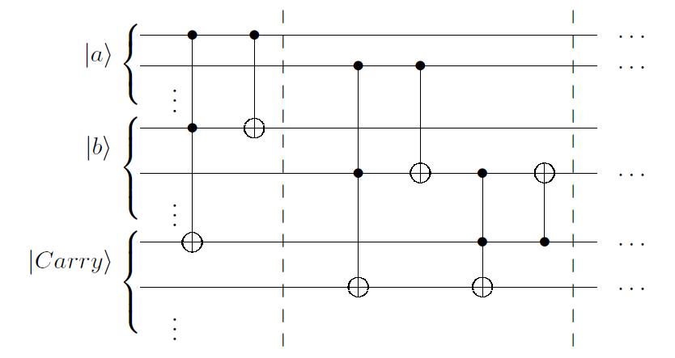
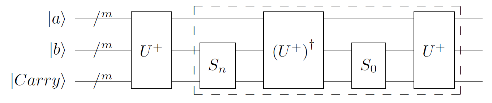
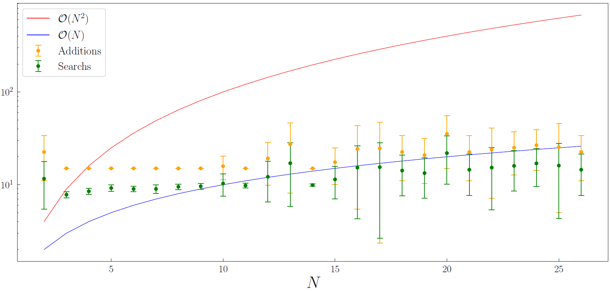

# QOSF Mentorship Program
---

# [Task 1] Quantum Algorithm for Verifying Goldbach's Conjecture

## **A more detailed Pdf version of this report is available [here](Task_1/report/report.pdf).**

**Abstract:**
This work introduces a quantum algorithm aimed at verifying Goldbach's conjecture, a famous mathematical hypothesis asserting that any even integer greater than two can be expressed as the sum of two prime numbers. Leveraging quantum parallelism and the Grover's algorithm, our proposed quantum circuit efficiently searches for pairs of prime numbers that satisfy this conjecture. Through comprehensive analysis and simulations, we demonstrate that the quantum approach exhibits a superior asymptotic complexity of $O(N)$ compared to the classical approach's $O(N^2)$, making it increasingly efficient as problem size grows. Our results confirm the practical viability of the proposed quantum circuit and underscore the potential of quantum computing in tackling complex mathematical challenges. This study encourages further exploration of quantum algorithms for mathematical conjectures and computational problems.

# Introduction

This report addresses Task 1 of the Screening task for the QOSF Mentorship Program, which involves finding two prime numbers from a given list that sum up to a positive integer. The task essentially requires the development of a quantum algorithm to verify Goldbach's conjecture, a longstanding mathematical hypothesis that posits any even integer greater than two can be expressed as the sum of two prime numbers [^1]. Despite its unsolved status, significant classical efforts have been made to test this conjecture, even with numbers as large as $4\cdot10^{14}$ [^2].

Quantum computing offers a promising avenue to verify Goldbach's conjecture, thanks to its exploitation of quantum parallelism. Quantum algorithms, such as the Deutsch-Jozsa algorithm, exemplify the power of quantum parallelism, providing exponential speedup in solving specific problems [^3]. Quantum algorithms reduce the computational burden significantly compared to classical counterparts.

To effectively harness quantum computations, measuring the desired outcomes accurately becomes crucial. Grover's algorithm [^4] emerges as a vital tool, amplifying the probability of measuring the desired outcome. This makes Grover's algorithm a suitable choice for tasks like verifying Goldbach's conjecture in quantum computing [^5] [^6].

# Quantum Approach

## Quantum Adder

In our quantum approach, we aim to add two integers by implementing the addition of their binary representations, taking advantage of quantum parallelism. We use the quantum analogs of classical logical gates, such as the $AND$ gate ($\cdot$) and the $XOR$ gate ($\oplus$). For example, to add 3 and 2 in binary ($11_2$ and $10_2$), we use these gates to perform the addition, resulting in $101_2$.

We implement a quantum operator $U^+$ that acts on three quantum registers: $A$ and $B$ for the binary representations of the numbers to be added, and a carry register. The result of the sum is encoded in the $B$ register and the most significant quantum bit of the carry register.

## Grover's Algorithm

To efficiently find the desired sum state after all possible additions, we employ Grover's algorithm. This quantum algorithm searches for a specific element in an unindexed database, offering a complexity of $\mathcal{O}_s(\sqrt{N})$, where $N$ is the number of elements. We aim to measure the state $\ket{p}\ket{p+q}$ such that $n = p+q$.

The Grover iterator operator $G$ consists of applying the Quantum Adder operator $U^+$, an oracle marking the state encoding the target number $n$, and an oracle marking the state zero. Grover's algorithm amplifies the probability of measuring the desired result state.

## Results

### Theoretical Complexity

We analyze the theoretical asymptotic complexity of both the quantum and classical approaches. The classical approach has a complexity of $\mathcal{O}_a(N^2)$ for both sums and searches. The quantum approach, primarily limited by Grover's algorithm, has a complexity of $\mathcal{O}(N/\sqrt{2k})$, where $k$ is the number of solutions. With appropriate parameters and assumptions, the quantum complexity can be approximated as $\mathcal{O}_{a/s}(N)$.

### Simulation Results

We conducted a simulation to test the quantum circuit for even integers $n$ in the range $[2, 100]$. The quantum circuit successfully found prime numbers $p$ and $q$ for all tested $n$. The number of additions and searches performed was counted. As shown in the results, for larger prime number lists, the quantum approach outperforms the classical approach, demonstrating its scalability and efficiency.

The plot compares the number of additions and searches required for different prime number list sizes $N$. As $N$ increases, the quantum approach surpasses the classical approach, confirming its favorable scalability.

# Conclusion

In conclusion, this work has introduced a quantum algorithm for verifying Goldbach's conjecture, a mathematical hypothesis stating that any even integer greater than two can be expressed as the sum of two prime numbers. The quantum circuit proposed in this study harnesses quantum parallelism and Grover's algorithm to efficiently search for pairs of prime numbers that add up to a given even integer.

A comprehensive analysis has shown that the quantum approach exhibits a favorable asymptotic complexity of $O(N)$ in contrast to the naive classical approach, which has an asymptotic complexity of $\mathcal{O}(N^2)$. This indicates that as the size of the problem scales up, the quantum solution becomes significantly more efficient compared to the classical counterpart.

Simulation results have further confirmed the effectiveness of the proposed quantum circuit, successfully solving the problem for various even integers and prime number lists. While the classical approach remains competitive for small-sized prime lists, the quantum solution outperforms it as the problem size increases.

Overall, this study underscores the potential of quantum computing to tackle complex mathematical problems efficiently and highlights the scalability and efficiency advantages of quantum algorithms when compared to classical methods. These findings encourage further exploration of quantum computing's capabilities in addressing mathematical conjectures and computational challenges.

# References

[^1]: Wang, Y. (2002). *The Goldbach Conjecture.* World Scientific.

[^2]: Richstein, J. (2001). Verifying the Goldbach conjecture up to $4\cdot 10^4$. *Mathematics of Computation*, 70(236), 1745-1749.

[^3]: Collins, D., Kim, K. W., & Holton, W. C. (1998). Deutsch-Jozsa algorithm as a test of quantum computation. *Physical Review A*, 58(3), R1633.

[^4]: Grover, L. K. (1996). A fast quantum mechanical algorithm for database search. *arXiv preprint quant-ph/9605043*.

[^5]: Latorre, J. I., & Sierra, G. (2013). Quantum computation of prime number functions. *arXiv preprint arXiv:1302.6245*.

[^6]: Prudêncio, T., & Silva, E. O. (2013). Goldbach conjecture sequences in quantum mechanics. *arXiv preprint arXiv:1303.6476*.
